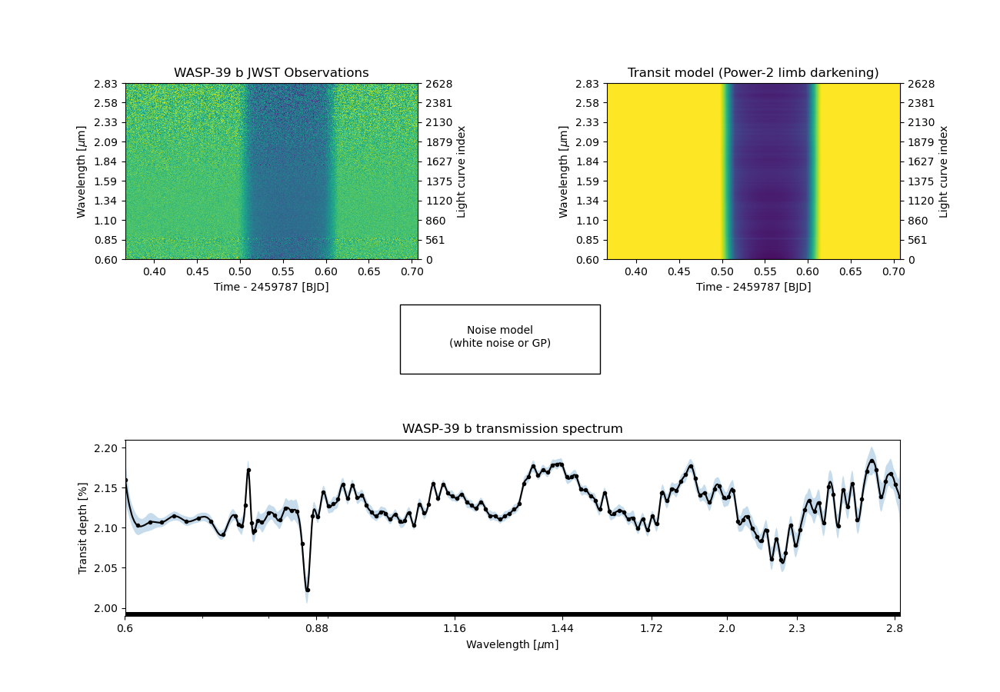

.. title:: ExoIris docs

.. rst-class:: frontpage

Easy Exoplanet Transmission Spectroscopy
========================================

.. image:: http://img.shields.io/badge/license-GPLv3-blue.svg?style=flat
   :target: https://www.gnu.org/licenses/gpl-3.0.en.html

.. image:: https://badge.fury.io/py/exoiris.svg
   :target: https://pypi.org/project/ExoIris/

.. image:: https://img.shields.io/badge/Contributor%20Covenant-2.0-4baaaa.svg
   :target: https://github.com/hpparvi/ExoIris/blob/main/CODE_OF_CONDUCT.md

Overview
--------

**ExoIris** is a user-friendly Python package designed to simplify and accelerate the analysis of transmission
spectroscopy data for exoplanets. The package can estimate a self-consistent medium-resolution transmission spectrum
with uncertainties from JWST NIRISS data in a matter of minutes, even when using a Gaussian Process-based noise model.

ExoIris uses PyTransit's `TSModel`, a transit model that is specially optimised for transmission spectroscopy and allows
for simultaneous modelling of hundreds to thousands of spectroscopic light curves 20-30 times faster than when using
standard transit models not explicitly designed for transmission spectroscopy.

A complete posterior solution for a low-resolution transmission spectrum with a data resolution of R=100
takes 3-5 minutes to estimate assuming white noise, or 5-15 minutes if using a Gaussian process-based likelihood
model powered by the celerite2 package. A high-resolution spectrum of the JWST NIRISS WASP-39 b observations
by `Feinstein et al. (2023) <https://ui.adsabs.harvard.edu/abs/2023Natur.614..670F/abstract>`_ with ~3800
spectroscopic light curves (as shown above) takes about 1.5 hours to optimise and sample on a three-year-old
AMD Ryzen 7 5800X with eight cores.

Documentation
-------------

.. toctree::
   :maxdepth: 2
   :caption: Getting Started

   install
   examples/index

.. toctree::
   :maxdepth: 1
   :caption: API Documentation

   api/exoiris
   api/tsdata
   api/binning

Support
-------

If you experience any difficulties with ExoIris, please submit an issue on the ExoIris
`GitHub <https://github.com/hpparvi/exoiris/issues>`_ repository. You are also encouraged to share suggestions or
feature requests either through the same method or by reaching out to the authors directly.

License
-------

ExoIris is licensed under the `GPLv3 <https://www.gnu.org/licenses/gpl-3.0.en.html>`_ license.