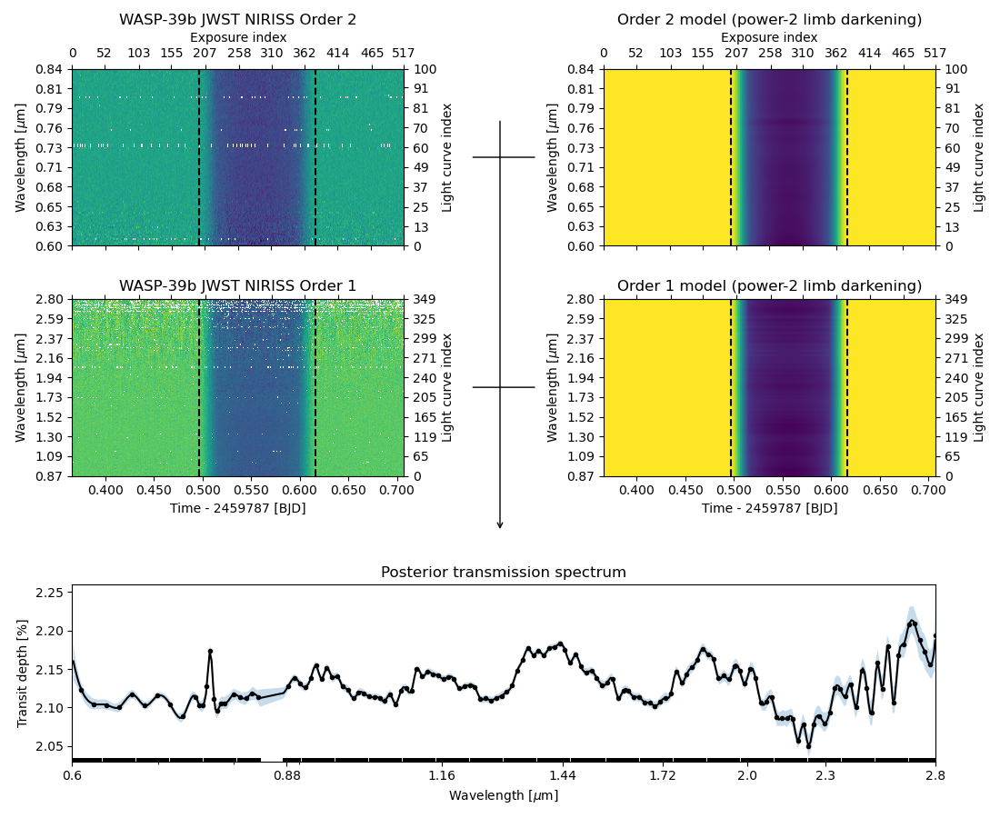

.. title:: ExoIris docs

.. rst-class:: frontpage

ExoIris: Easy Exoplanet Transmission Spectroscopy
=================================================

.. image:: http://img.shields.io/badge/license-GPLv3-blue.svg?style=flat
   :target: https://www.gnu.org/licenses/gpl-3.0.en.html

.. image:: https://badge.fury.io/py/exoiris.svg
   :target: https://pypi.org/project/ExoIris/

.. image:: https://img.shields.io/badge/Contributor%20Covenant-2.0-4baaaa.svg
   :target: https://github.com/hpparvi/ExoIris/blob/main/CODE_OF_CONDUCT.md

.. image:: https://zenodo.org/badge/DOI/10.5281/zenodo.18598642.svg
  :target: https://doi.org/10.5281/zenodo.18598642

Overview
--------

**ExoIris** is a Python package for exoplanet transmission spectroscopy that models full 2D spectroscopic transit
time series directly, estimating self-consistent transmission spectra with uncertainties. It supports joint
multi-instrument, multi-epoch analyses with flexible spectral resolution, Gaussian process noise models,
transit timing variations, spot-crossings, and inclusion of the transit light source effect.

A complete analysis,
including optimization and MCMC sampling, typically takes minutes to tens of minutes, though the most complex
multi-instrument analyses may take up to a few hours. See the feature overview below for details.

.. grid:: 3
   :gutter: 2

   .. grid-item-card:: Joint Modeling
      :link: features/joint_modeling
      :link-type: doc

      Analyse multiple instruments and epochs in a single self-consistent model.

   .. grid-item-card:: Flexible Spectral Resolution
      :link: features/flexible_resolution
      :link-type: doc

      Decouple data resolution from transmission spectrum resolution.

   .. grid-item-card:: Spot Crossing & TLSE
      :link: features/spot_modeling
      :link-type: doc

      Model spot-crossing events and the transit light source effect.

   .. grid-item-card:: Transit Timing Variations
      :link: features/ttvs
      :link-type: doc

      Fit transit centres per epoch to account for TTVs.

   .. grid-item-card:: Baseline Modeling
      :link: features/baseline_modeling
      :link-type: doc

      Account for instrumental and astrophysical systematics.

   .. grid-item-card:: Flux Offsets
      :link: features/offsets
      :link-type: doc

      Account for additive offsets between datasets.

   .. grid-item-card:: Reproducible Analyses
      :link: features/savefiles
      :link-type: doc

      Save and restore complete analyses as self-contained FITS files.

   .. grid-item-card:: Retrieval Likelihood
      :link: features/loglikelihood
      :link-type: doc

      A custom likelihood function for atmospheric retrieval.

.. toctree::
   :hidden:

   features/index

Documentation
-------------

.. toctree::
   :maxdepth: 2
   :caption: Getting Started

   install
   examples/index

.. toctree::
   :maxdepth: 1
   :caption: API Documentation

   api/exoiris
   api/tsdata
   api/binning
   api/ldtkld
   api/utilities

Support
-------

If you experience any difficulties with ExoIris, please submit an issue on the ExoIris
`GitHub <https://github.com/hpparvi/exoiris/issues>`_ repository. You are also encouraged to share suggestions or
feature requests either through the same method or by reaching out to the authors directly.

License
-------

ExoIris is licensed under the `GPLv3 <https://www.gnu.org/licenses/gpl-3.0.en.html>`_ license.